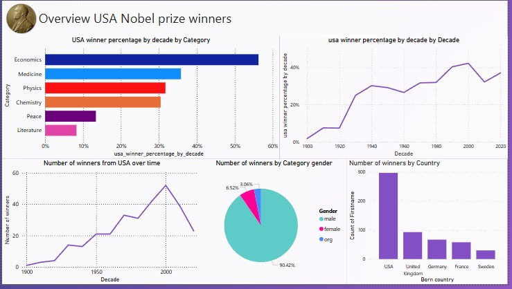
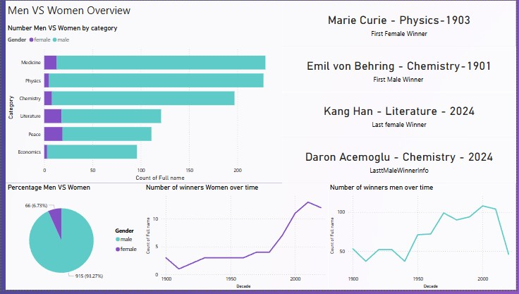

# 🏆 Nobel Prize Winners - Data Analysis Project

This project started as a small Python exercise from a DataCamp course and grew into a complete Power BI dashboard with real-world insights from Nobel Prize winners data (1901–2023).

---

## 🔍 What This Project Covers:
- **Data Cleaning**: The dataset was originally unstructured, with missing values and inconsistent formatting. Cleaning was done before any analysis.
- **Exploratory Data Analysis**:
  - USA ranks 1st with **297** Nobel winners
  - The most successful decade was the **2000s**, with USA winning over **42%** of prizes
  - **Gender Gap**: Only **6.73%** of the winners are female
  - **Marie Curie** was the first woman to win a Nobel Prize, in **Physics (1903)**
- **Visualization**: Power BI dashboard visualizing winners by:
  - Country
  - Gender
  - Category
  - Decade

---

## 💡 Tools Used:
- `Python` (Pandas, NumPy)
- `Power BI`
- `Excel` (for light preprocessing)
- `DataCamp` as the initial source for project inspiration

---

## 📷 Dashboard Preview:

---

## 🤝 About Me

I'm **Ramy Hasan**, an aspiring data analyst with a passion for uncovering insights from messy data and transforming them into meaningful stories.

Feel free to connect with me on [LinkedIn](https://www.linkedin.com/in/ramy-hasan/) or reach out for feedback, collaboration, or just to chat!

---

## 📌 Tags:
`#DataAnalysis` `#PowerBI` `#Python` `#NobelPrize` `#DataVisualization` `#Storytelling`
